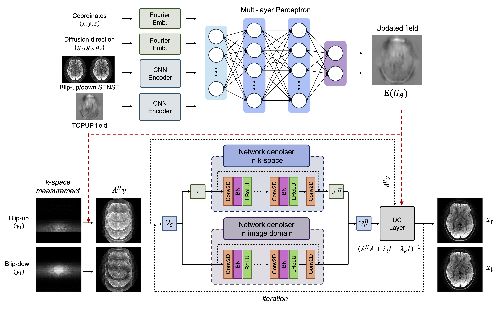
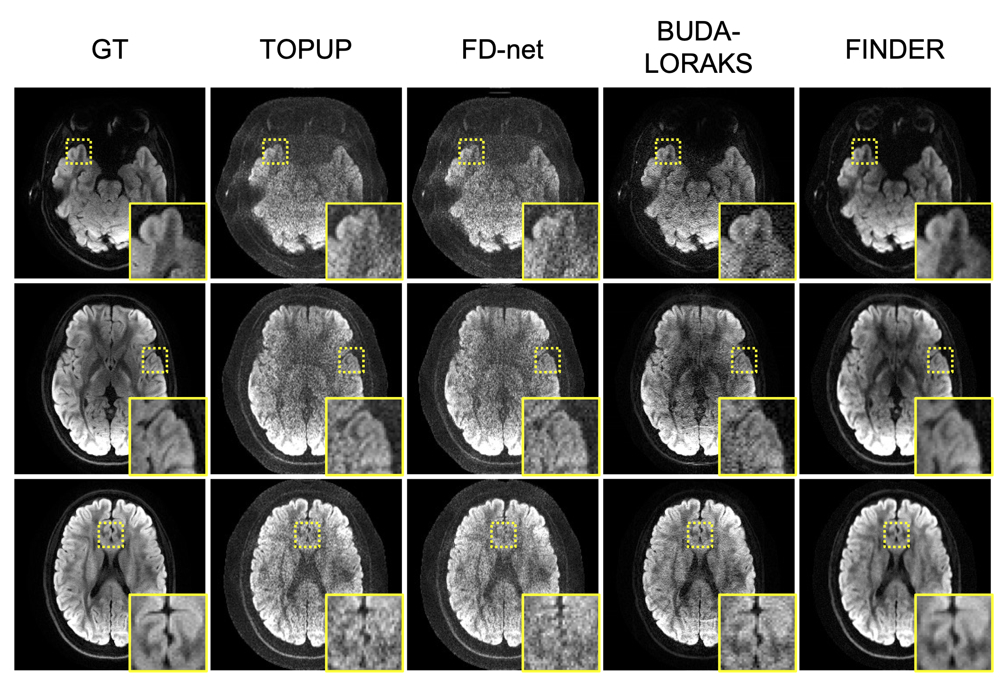
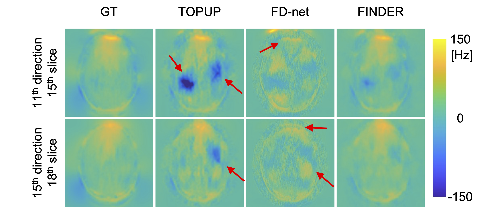

# FINDER: Zero-Shot Field-Integrated Network for Distortion-free EPI Reconstruction in Diffusion MRI

## FINDER Overview

FINDER is a zero-shot, scan-specific framework that jointly reconstructs highly accelerated blip-up/down EPI data and corrects geometric distortions without relying on external training datasets.

FINDER couples a **physics-guided unrolled network** with dual-domain denoisers and virtual coil extensions for robust image recovery, with an **Implicit Neural Representation (INR)** to model the B0 field map as a continuous, differentiable function. The two modules are jointly optimized in a fully **zero-shot, self-supervised** manner using only the acquired k-space data.

 <br>

*Overview of the proposed FINDER framework. The upper part presents the INR network for field map updates, while the lower part details the physics-guided unrolled image reconstruction network.*

 <br>

*Visual comparison of diffusion-weighted images at 5-fold acceleration. Yellow insets highlight baseline artifacts effectively suppressed by FINDER.*

 <br>

*Visual comparison of estimated field maps. Red arrows indicate severe estimation errors in TOPUP and FD-net, which are effectively mitigated by FINDER.*

## Installation

Dependencies:

| Package | Version |
|---------|---------|
| Python  | 3.10.19 |
| PyTorch | 2.4.1  |
| NumPy   | 1.26.4  |

```
pip install torch==2.4.1 numpy==1.26.4 scipy matplotlib
```

## How to use

Testing can be performed by running `FINDER_inference.ipynb`. Prior to running, set the paths and parameters at the top of the notebook:

```python
save_path  = './'
model_name = save_path + 'FINDER.weights.h5'   # Path to trained model weights
res_name   = save_path + 'results/FINDER.mat'  # Output path
data_path  = './data'                           # Data directory

target_slice = 16               # Slice index to reconstruct
target_diffs = [0, 15, 25, 31]  # Diffusion direction indices
```

The notebook saves results to a `.mat` file containing:
- `im_recon`: Reconstructed complex images `(n_diff, 2, nx, ny)`
- `im_field`: Estimated field maps `(n_diff, nx, ny)`

